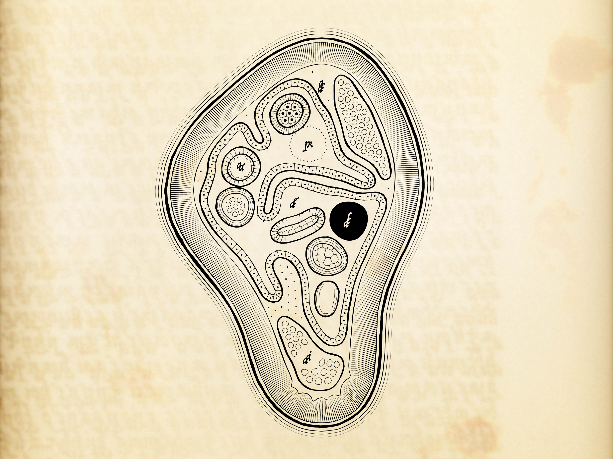
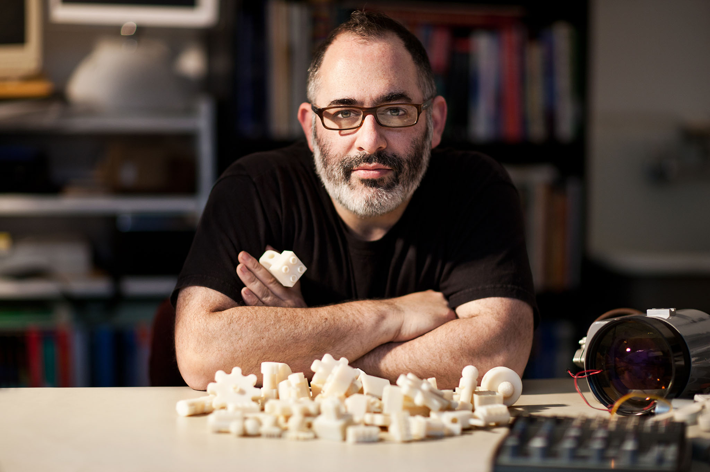

# Cytographia

[*Cytographia*](https://www.artblocks.io/collections/curated/projects/0x99a9b7c1116f9ceeb1652de04d5969cce509b069/487) is a real-time interactive, dynamically animated, generative artwork by Golan Levin. Editioned on the Ethereum blockchain by Art Blocks Curated • January, 2024

**Quick Links:**

* The live, real-time interactive *Cytographia* project [**can be experienced here**](https://www.artblocks.io/collections/curated/projects/0x99a9b7c1116f9ceeb1652de04d5969cce509b069/487/tokens/487000217).  Please press **RETURN** to generate a new form, or press **H** for a list of key commands.
* The 418 uniquely generated tokens in the Cytographia edition [**can be browsed here**](https://www.artblocks.io/collections/curated/projects/0x99a9b7c1116f9ceeb1652de04d5969cce509b069/487?section=collection&category=collections&vertical=curated&contract_id=0x99a9b7c1116f9ceeb1652de04d5969cce509b069&project_id=487&sortOrder=Invocation%20low%20to%20high).

**Contents:**

* [About Cytographia](#about-cytographia)
* [Display Notes](#display-notes)
* [Acknowledgements](#acknowledgements)
* [About Golan Levin](#about-golan-levin)
* [Charitable Giving](#charitable-giving)

**Additional Resources and Press:**

* Golan Levin, [*Artist's Notes on Cytographia*](notes/README.md), January 2024.
* Jordan Kantor, [*In Conversation with Golan Levin on Cytographia*](https://artblocks.io/info/spectrum/in-conversation-with-golan-levin-on-cytographia), *Art Blocks Spectrum,* January 2024. [[PDF]](press/golan_levin_artblocks_spectrum_2024.pdf)
* Peter Bauman, [*Golan Levin on the Potentiality of Blobs*](https://www.lerandom.art/editorial/golan-levin-on-the-potentiality-of-blobs), *Le Random*, January 2024. [[PDF]](press/golan_levin_lerandom_2024.pdf)
* Regina Harsanyi, [*Art of Algorithms with Golan Levin and Regina Harsanyi (Interview)*](https://www.youtube.com/watch?v=7RIFl_gJfL0), *YouTube*, January 2024.
* Aluan Wang, [*On Cytographia*](https://twitter.com/IOivm/status/1745720974350467420), *Twitter*, 12 January 2024. [[PDF]](press/aluan_wang_on_cytographia_2024.pdf)
* ArtBlocks Promotional Videos [#1](https://www.youtube.com/watch?v=f-_kaz3LfOI) • [#2](https://www.youtube.com/watch?v=gCMPjS4013U) • [#3](https://www.youtube.com/watch?v=lTzLbwe_z50)

---

<image src="notes/images/cytographia_cell.gif" width="100%">

### About *Cytographia*

> *The live, interactive Cytographia project [**can be experienced here**](https://www.artblocks.io/collections/curated/projects/0x99a9b7c1116f9ceeb1652de04d5969cce509b069/487/tokens/487000217).* *Please press* **RETURN** *to generate a new form, or press* **H** *for a list of key commands.*

*Cytographia* is an elegy for species we will never know, or will never know again, expressed through generative illustrations from an imaginary book about imaginary organisms. This cytopoietic codex depicts speculative cell structures whose appearances and movements arise emergently and in response to real-time user interactions. *Cytographia* was created using [p5.js](https://p5js.org/) (an open-source programming toolkit for the arts) and may run best in the Chrome browser on OSX.

An algorithmic "neoincunabulum of xenocytology", *Cytographia* presents an interactive diagram of a one-celled microorganism, styled to evoke a hand-drawn engraving. Every aspect of this illustration is generated through custom code, including the simulated behavior and anatomy of the depicted creature, the calligraphic quality of its lines, the asemic letterforms of its labels, and the virtual "paper" on which it is rendered. *Cytographia*'s drawings may be exported as high-resolution PNG images, or in an SVG vector format suitable for pen-plotting.

According to a recent estimate, there are about one trillion species of microbes on Earth, of which 99.999% have yet to be discovered.¹ Experts have also calculated that between 0.01 and 0.1% of all Earth's species are becoming extinct each year.² If these estimates are accurate, then between 100 million and 1 billion species are becoming extinct each year — the vast majority of which are undiscovered microbes. *Cytographia* offers a Borgesian speculation on what these vanishing lifeforms might have been like to observe and interact with.

The *Cytographia* project draws inspiration from several historically significant books that visually and methodically documented encounters with the unknown. These include Robert Hooke's *[Micrographia](https://en.wikipedia.org/wiki/Micrographia)* (1665), a landmark of scientific observation in which living cells were described for the first time; Edmund Fry's *[Pantographia](https://en.wikipedia.org/wiki/Pantographia)* (1799), an attempt to compile exemplars of all the world's writing systems; Ernst Haeckel's [*Kunstformen der Natur*](https://en.wikipedia.org/wiki/Kunstformen_der_Natur) (1899), a rich exploration of symmetry and structural hierarchy in natural forms; and Luigi Serafini's hallucinatory *[Codex Seraphinianus](https://en.wikipedia.org/wiki/Codex_Seraphinianus)* (1981), a visual encyclopedia of an artist's imagined world. The generative letterforms in *Cytographia* are loosely based on 16th-century typefaces by [Ludovico degli Arrighi](https://en.wikipedia.org/wiki/Ludovico_Vicentino_degli_Arrighi).

*Cytographia* represents a culmination of several long-time threads in Golan Levin's thirty-year *oeuvre* of interactive software art, including research into responsive blobs (e.g. [*Polygona Nervosa*](https://objkt.com/asset/hicetnunc/56312), 1997); artificial life (e.g. [*Obzok*](https://www.youtube.com/watch?v=oVOCKzE2fZk), 2001); the use of physics simulations in computational drawing (e.g. [*Floccus*](https://artbase.rhizome.org/wiki/Q3783), 1999) and the algorithmic generation of asemic writing systems (e.g. [*Alphabet Synthesis Machine*](https://en.wikipedia.org/wiki/Alphabet_Synthesis_Machine), 2002).

*Cytographia* requires a modern browser with WebGL and hardware acceleration enabled. The recommended configuration for *Cytographia* is the Chrome browser on MacOS, in which the artwork is known to produce consistent and replicable results. The project responds to both mouse/touch and keyboard interactions. An index of *Cytographia*'s key commands can be displayed by pressing **h** (for "help"). These key commands provide access to functionality including file export; toggles that enable or disable various graphical options, potentially improving performance on some systems; and access to a playful "sandbox" mode, in which a collector or visitor can assemble the organelles of their own imaginary lifeform.

1. ["Earth May Be Home to a Trillion Species of Microbes"](https://www.nytimes.com/2016/05/24/science/one-trillion-microbes-on-earth.html), *New York Times*, May 23, 2016.
2. ["How Many Species are We Losing?"](https://wwf.panda.org/discover/our_focus/biodiversity/biodiversity/), World Wildlife Fund.

---
### Display Notes

*Cytographia* requires a modern browser with WebGL and hardware acceleration enabled. The recommended configuration for *Cytographia* is the Chrome browser on MacOS, in which the artwork is known to produce consistent and replicable results.

The artwork responds to both mouse/touch and keyboard interactions. An index of *Cytographia*'s key commands can be displayed by pressing **h** (for "help"). These key commands provide access to functionality including file export; toggles that enable or disable various graphical options, potentially improving performance on some systems; and access to a playful "sandbox" mode, in which a collector or visitor can assemble the organelles of their own imaginary lifeform.

Please note that [the precision of the JavaScript Math library is implementation-dependent](https://developer.mozilla.org/en-US/docs/Web/JavaScript/Reference/Global_Objects/Math). This means that browsers and/or operating systems other than the recommended configuration may produce different results for the same series of mathematical operations. The *Cytographia* project is particularly susceptible to this, since it constantly simulates millions of interactions between thousands of particles. Over time, these environment-based differences may accumulate to produce visibly different results. *Cytographia* was developed using JavaScript version Mozilla/5.0 (Macintosh; Intel Mac OS X 10_15_7) with AppleWebKit/537.36 (KHTML, like Gecko), and was tested in Google Chrome version 120.0.6099.129 (arm64) on a MacBook Pro (14-inch, 2021) with an Apple M1 Pro CPU, running macOS Sonoma 14.1.2 (23B92).

Signed pen-plots of *Cytographia* tokens are available for interested collectors through [Artfora.com](https://www.artfora.com/collections/cytographia) until the end of February 2024. Plots are produced on acid-free paper using a vintage HP7475A pen plotter.

---

### Acknowledgements

*Cytographia* incorporates or adapts the following code under the specified licenses: [*p5.js v.1.0.0*](https://p5js.org/) by The Processing Foundation (GPL); [*Fortune's Voronoi*](https://github.com/d3/d3-delaunay) by Mike Bostock (Observable/Mapbox) (ISC); [*GLSL Blend Modes*](https://github.com/jamieowen/glsl-blend) by Jamie Owen (MIT); [*GLSL Value Noise*](https://www.shadertoy.com/view/lsf3WH) and [*GLSL XOR Noise*](https://www.shadertoy.com/view/XtXXD8) by Inigo Quilez (MIT); [*2D Perlin Noise*](https://github.com/stegu/webgl-noise/blob/master/src/classicnoise2D.glsl) by Stefan Gustavson (MIT); [*ImageJ (Distance Transform)*](https://github.com/imagej/ImageJ/blob/master/ij/process/BinaryInterpolator.java) by NIH (Public Domain); [*ofPolyline*](https://github.com/openframeworks/openFrameworks/tree/master/libs/openFrameworks/graphics) from openFrameworks (MIT); [*GLSL p5jsShaderExamples*](https://github.com/aferriss/p5jsShaderExamples/) by Adam Ferriss (MIT); and [*webgl-lines*](https://mattdesl.github.io/webgl-lines/expanded/gl-line-2d.js) by Matt DesLauriers (MIT). *Cytographia* additionally adapts the following code and/or media, whose authors appear not to have specified a license: [*GLSL LA Font*](https://github.com/hi-ogawa/python-shader-app/tree/master/misc/la_font) by Hi Ogawa; [*Delaunay Triangulation*](https://editor.p5js.org/allison.parrish/sketches/BkhEmKKjW) by Allison Parrish; [*Closest Point of a Polygon*](https://codesandbox.io/s/elated-liskov-3v65c?file=/src/getClosestPointInsidePolygon.ts) by Daniel Neveux; [*Point, Line, Plane*](http://paulbourke.net/geometry/pointlineplane/) by Paul Bourke; [*Flocking/Boids*](https://p5js.org/examples/simulate-flocking.html) by Craig Reynolds, adapted by Daniel Shiffman; and [*Arrighi*](https://en.wikipedia.org/wiki/Ludovico_Vicentino_degli_Arrighi) (1523) by Ludovico Vicentino degli Arrighi. The following writings were also essential references for this work: [*Introduction to p5.js shaders*](https://itp-xstory.github.io/p5js-shaders/#/) (2019) by Casey Conchinha and Louise Lessél; [*Drawing Lines is Hard*](https://mattdesl.svbtle.com/drawing-lines-is-hard) (2015) by Matt DesLauriers; [*Entering the Blobosphere: A Musing on Blobs*](http://www.lauraonsale.com/blob.html) (2019) by Laura Hyunjhee Kim; and [*The Nature of Order: The Phenomenon of Life*](https://archive.org/details/natureoforderess0000alex_i7q2/page/142/mode/2up) (2002) by Christopher Alexander. Special thanks to Erick Calderon, Dmitri Cherniak, Chris Coleman, Regina Harsanyi, Lingdong Huang, Zach Lieberman, Casey Reas, and James Paterson.

---
### About Golan Levin

Golan Levin (b. 1972) is a Pittsburgh-based artist, researcher and educator. His work explores new intersections of machine code, visual culture, and critical making in order to highlight our relationship with machines, expand the vocabulary of human action, and awaken participants to their potential as creative actors.

Active professionally in software art since 1995, Levin's work is included in the permanent collections of the [Museum of Modern Art](https://www.moma.org/artists/39123), [ZKM Karlsruhe](https://zkm.de/en/artwork/messa-di-voce), and the [Cooper-Hewitt Smithsonian Design Museum](https://collection.cooperhewitt.org/people/51679259/objects/), and has been featured in exhibitions at venues including the [Beall Center for Art and Technology](https://beallcenter.uci.edu/exhibitions/eyecode), [bitforms gallery](https://bitforms.art/exhibition/golan-levin-new-installations-and-sculpture/), the [Whitney Biennial](https://whitney.org/www/2004biennial/flash/poplg.php), Ars Electronica, Art Center Nabi, Espacio Fundación Telefónica, ICA London, La Gaîté Lyrique, and the NTT InterCommunication Center.

Levin earned degrees in Media Arts and Sciences from the MIT Media Laboratory. He is presently Professor of electronic art in the [School of Art at Carnegie Mellon University](https://art.cmu.edu/people/golan-levin/), where his pedagogy is concerned with reclaiming computation as a medium of personal expression. With Tega Brain, Levin is co-author of [*Code as Creative Medium*](https://mitpress.mit.edu/9780262542043/code-as-creative-medium/), an essential guide to creative coding for software arts educators.

 *Photo by Tom Cwenar. Courtesy Fortune Magazine.*

---
### Charitable Giving

Through CryptoForCharity’s [Environmental Conservation Cause Fund](https://www.cryptoforcharity.io/cause-funds/environmental-conservation), 20% of Cytographia’s secondary market royalties will be donated via contract to non-profit organizations that support biodiversity preservation and tackle the effects of climate change, including the World Wildlife Fund (WWF), Waterkeeper Alliance, The Life You Can Save, and the Coral Restoration Foundation.
