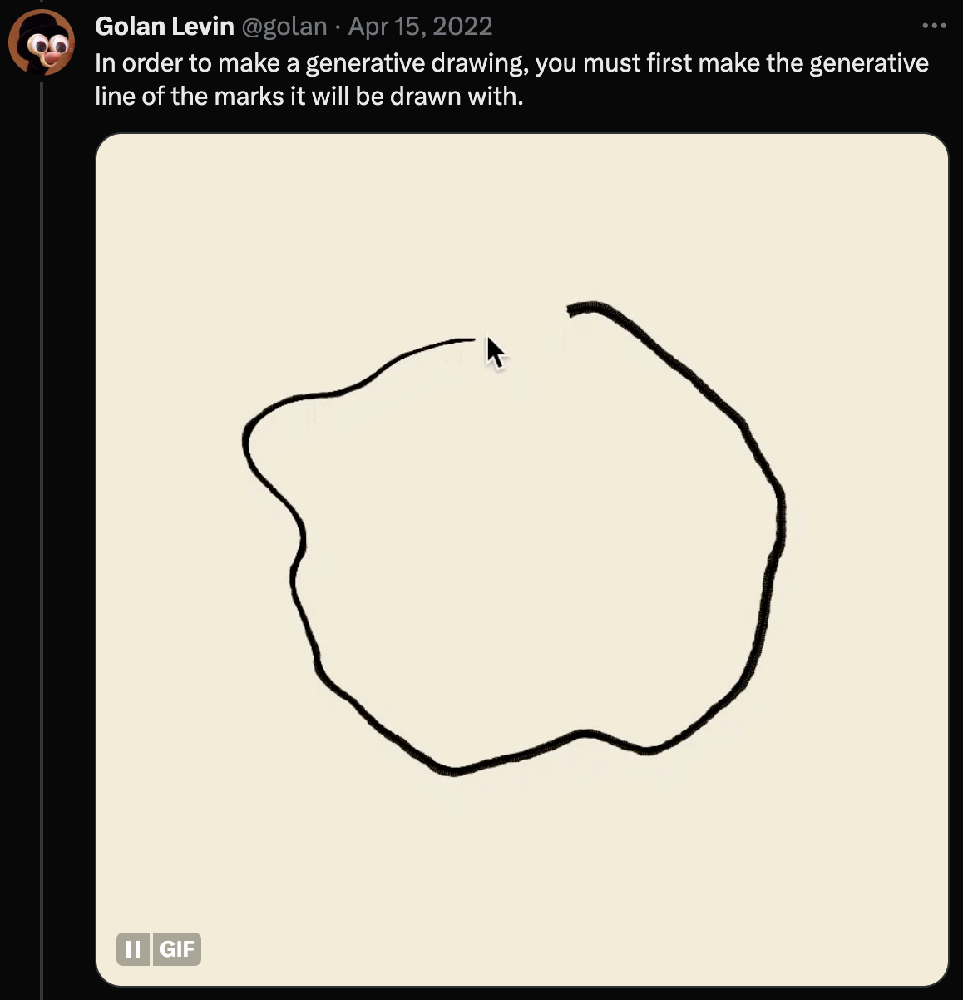

# Author's Notes on *Cytographia*

I have kept a loose journal about my development of *Cytographia* in [this Twitter thread](https://twitter.com/golan/status/1472819559791013891). In addition, this page documents a few thoughts I have had about the motivation and implemenation of the project. 

* [Encountering Unknown Species](#encountering-unknown-species)
* [A Personal History of Generative and Interactive Blob Research](#a-personal-history-of-generative-and-interactive-blob-research)
* [From-Scratch Making in *Cytographia*](#from-scratch-making-in-cytographia)
* [The Paper Debate](#the-paper-debate)

---


### Encountering Unknown Species

"Cytographia" is an elegy for species we will never know, or will never know again, expressed through generative illustrations from an imaginary book about imaginary organisms.

> "According to a new estimate, there are about one trillion species of microbes on Earth, and 99.999 percent of them have yet to be discovered."[1]

> "The rapid loss of species we are seeing today is estimated by experts to be between 1,000 and 10,000 times higher than the natural extinction rate. These experts calculate that between 0.01 and 0.1% of all species will become extinct each year."[2]

If there are a trillion different species co-existing with us on our planet, then between 100 million and 1 billion species are becoming extinct each year — the vast majority of which are undiscovered microbes. *Cytographia* offers a Borgesian speculation on what these vanishing lifeforms might have been like to observe and interact with.

**References:**

1. ["Earth May Be Home to a Trillion Species of Microbes"](https://www.nytimes.com/2016/05/24/science/one-trillion-microbes-on-earth.html), *New York Times*, May 23, 2016.
2. ["How Many Species are We Losing?"](https://wwf.panda.org/discover/our_focus/biodiversity/biodiversity/), World Wildlife Fund.


---

### A Personal History of Generative and Interactive Blob Research

[Laura Hyunjhee Kim](https://www.amazon.com/Entering-Blobosphere-Laura-Hyunjhee-Kim/dp/1948700182) has written: 

```
A blob is a raw amorphous form
A blob is a potentiality
A blob is an indeterminate destination
A blob is a liminal manifestation of the inexplicable
A blob is neither this nor that but points as is
A blob is a transitional state of being
A blob is a subtle deconstruction of preconceptions
A blob is a real-time negotiation
A blob is a polite refusal of hierarchy
A blob is a poetic irregularity
A blob is a vague matter of existence
A blob is a sensitization to nonlinearity
```

The Platonic circle and square are the same for everyone, but there are as many blobs as artists. Blobs are the ultimate bespoke form, and there is no readymade Processing command, or even a single common algorithm, to make one. For this reason, writing code to generate a blob is a rite of passage for my creative coding students at Carnegie Mellon.


I have been chasing a vision for computational blobs for more than 30 years. I'm not only interested in how blobs can be *generated*, but also in how they can be *animated* — or more accurately, *brought to life*. In several of my experiments discussed below (*ALIVE, Polygona Nervosa, Obzok, Space Chicken, Merce's Isosurface*), blobby creatures are interactively guided or puppeteered by human gesture. 


My first blob project was [a scene in the *ALIVE* project](https://vimeo.com/18824784) (1992), a research initiative and immersive environment directed by Prof. Pattie Maes at the MIT Media Laboratory, where I worked as an undergraduate research assistant. In this scene, a flock of Bézier blobs flocked around the user's outstretched hand, as tracked by a computer vision system developed by doctoral student Trevor Darrell. ALIVE was presented at SIGGRAPH 1992. Here I am as an undergraduate in 1992, demonstrating the system.


In 1996-1997, while working at Interval Research Corporation in Palo Alto, I collaborated with cognitive psychologist Shelly Wynecoop on an investigation into sound-shape mappings known as *phonesthesia*. I developed a Java program to generate thousands of blob shapes with a range of controllable features, such as pointiness and roundness. Inspired by Wolfgang Köhler's well-known [*Maluma/Taketa*](images/maluma-takete.jpg) experiment, Wynecoop's investigation used my blob images to examine the extent to which these visual aspects of shape were correlated with different phonetic sounds. 


In 2000, I used my code from the phonesthesia experiment to generate a series of blobs, called *Snoogs*. These were printed on acid-free paper and mounted on rotating frames, which viewers were invited to turn. The project was exhibited at the Bitforms gallery in 2000. 


In 1997, I conceived a gestural interaction by which a user could simultaneously specify both the form and also the quality of movement of an animated blob. This system, *Polygona Nervosa*, is described in detail in my 2000 Masters thesis from MIT, [*Painterly Interfaces for Audiovisual Performance*](http://flong.com/archive/storage/pdf/articles/thesis300.pdf) (p.66-69). Much later, this project was published on *Hic et Nunc* in April 2021 as part of [#TheFEN](https://github.com/crcdng/hen-timeline/blob/main/timeline.md#april-19-2021) coordinated NFT drop, curated by Juliette Bibasse. 


In 2001, I organized and curated [Singlecell.org], a monthly online bestiary. Singlecell featured "a collection of online life-forms discovered and reared by a diverse group of computational artists and designers", including Casey Reas, Lia, Joshua Davis, and Marius Watz. My own contribution to the bestiary was [*Obzok*](https://flong.com/archive/projects/obzok/index.html), an interactive virtual creature consisting of a blob scaffolded by a springy mesh.


In 2002-2003, I developed the ["Messa di Voce"](https://flong.com/archive/projects/messa/index.html) performance in collaboration with Zach Lieberman. One of the scenes, called *Space Chicken*, involved a blobby ["voice sensitive costume"](https://vimeo.com/25037421), performed and worn by Joan La Barbara. The shape of the projected blob was tightly coupled to the performer's body (tracked by a camera), as well as her voice. 


In 2009, along with Casey Reas and others, I was commissioned by the Boston Cyberarts Festival to develop a visual treatment of motion capture data [produced by Merce Cunningham using his hands](https://vimeo.com/manage/videos/17228065). In my project, [*Merce's Isosurface*](https://vimeo.com/4272382), the digitally captured coordinates of Cunningham's fingers and knuckle joints are used to structure a smooth field of simulated energy. The result is a twitchy, fleshy blob, animated by Cunningham's own living movements, which dances in the liminal territory between pure abstract form and medical information visualization. 


In 2016, I organized a conference at CMU on "new and independent visions for virtual and augmented reality". For this conference, I wrote a Processing program to algorithmically generate unique badges for each of the 300 guests. The badges featured a cute blob with eyes, feelers, and a central orifice. 


*Cytographia* generates blobs-within-blobs, in an attempt to render the interior structures of dynamic organisms.


---

### From-Scratch Making in *Cytographia*



The use of readymade graphical elements in creative coding is expedient, but also represents a type of aesthetic forfeiture. Dominikus Baur [has observed](https://twitter.com/dominikus/status/1598370354531282945) that organic form, imperfection, and wabi-sabi "don't come for free on our cool machines". 


It was important to me that every aspect of the Cytographia project reflect deliberate choices on my part. As Cytographia was clearly shaping up to be a "drawing" or "illustration" comprised of linework, I needed to *make the lines my own*. [In my project diary of 17 April 2022](https://twitter.com/golan/status/1517366880566231089), I noted that I had found a way to produce custom lines, using vertex shaders.


The difference between my bespoke lines and the readymade lines of p5.js may be very subtle, but is hopefully evident from close examination in this side-by-side comparison. 


--- 

### The Paper Debate


A debate is simmering on Twitter about skeumorphism in generative art. The debate is typified by these two (mutually contradictory) comments by Joshua Davis. On the one hand, Davis states that he doesn't prefer generative art that imitates analog media; on the other, he states that he loves to include noise (...an imitation of analog media) in his work because it makes everything better.


@zachlieberman, [Dec 14, 2022](https://twitter.com/zachlieberman/status/1603027801493446657)
> no judgements but I think too much generative art is trying to hard to look like paper. we are working with pixels, colors and light here, why simulate a paper medium?    (@golan gets a pass!)

> paper is awesome - I love prints, I studied printmaking, love plotter art, etc....   but I feel what's fascinating here is finding the "grain" of computational art -- what do the code, algorithms and systems feel like.  I think trying too hard to be like paper clouds that.

> sometimes it can be awesome -- but often it feels to me a little cheap, like a filter applied at the end to make something feel more organic.  organic energy can come elsewhere and be more holistically connected to the artwork.
 

@golan, [Dec 14, 2022](https://twitter.com/golan/status/1603097227811065859)

> I've argued elsewhere that textural 'noise' is perceptually valuable. But in my current work in progress—as a personal challenge—I literally decided to try too hard to simulate a paper medium. This is very deliberately a (bibliomanic, skeuomorphic, and probably kitsch) homage to old diagrams.

> So, a guilty pleasure. But also: my focus in this particular work is dynamism and interactivity—i.e., the 'medium of response'—not 'colors and light'. To me, this makes it as 'born digital' as anything. The nod to paper helps tell a story, but is not the point.

@zachlieberman, [Dec 7, 2023](https://twitter.com/zachlieberman/status/1732746357662753232)

>  I’m generally anti skeuomorphism in generative art but also I feel like everyone should do what they want!  Some of my favorite work comes out of investigations of physical materials and how to simulate them in code

> Like I spend a lot of time thinking of how simulate light — there’s a joy there in exploring how simulations feel and fail in interesting ways.  Could very well be paper grain or ink texture etc

> I don’t like making things look old — that seems weird to me — but it’s more of a personal choice.  I want to explore the grain and texture of computation

@golan, [Dec 7, 2023](https://twitter.com/golan/status/1732845369724203451)

> When I began my career (c.1996) I was fanatically anti-skeumorphic and religiously committed to divining the intrinsic properties of the computer medium. Yellowtail is one example of my work from that time: the artwork couldn't even *exist* until it was interacted with.

> Not only did I eschew pre-loaded assets and pre-determined compositions. I even remember not comprehending why Casey was bothering to print his stuff out. *Printing!?* It seemed nostalgic, quaint, even downright twee next to generative, dynamic, interactive form.

> Of course, that was all before Director, Java, Flash, and OSX10 apps stopped working. I was too naive to imagine that software could just — stop working. Today, I'm privileged to own some of Casey's prints from that era, which... still work.

> Recently I was watching *Peaky Blinders*, a historical fiction set in 1920, and I was admiring the production's use of props, costumes, and set design to create the illusion of a scene from 100 years ago. Somehow we don't criticize cinema for "making things look old".

@wblut, [Dec 6, 2023](https://twitter.com/wblut/status/1732287976711839963)
> ❤️❤️❤️ I love everything about Cytographia except the cheesy paper. 😄 

@golan, [Dec 6, 2023](https://twitter.com/golan/status/1732301124328161436)

> I'm public with my ambivalence regarding its skeuomorphism. But — it's where the piece led me. I reckoned I might as well (try to) make the final word in this 'paper' business.

@wblut, [Dec 6, 2023](https://twitter.com/wblut/status/1732287976711839963)

> Is there an inverted option for digital screens? 

@golan, [Dec 6, 2023](https://twitter.com/golan/status/1732301124328161436)

> This honestly hadn't occurred to me. So much of the appearance of the project (quite apart from the paper) is an attempt to understand idioms of illustration and engraving techniques, such as hachure. These don't make the same sense when inverted.

> For me, the 'heart' of the project is simulation, dynamism, and interactivity. In terms of the appearance, I've only thought of the piece as a "drawing". 